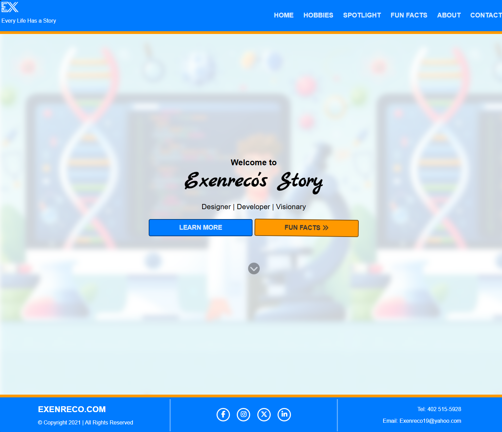
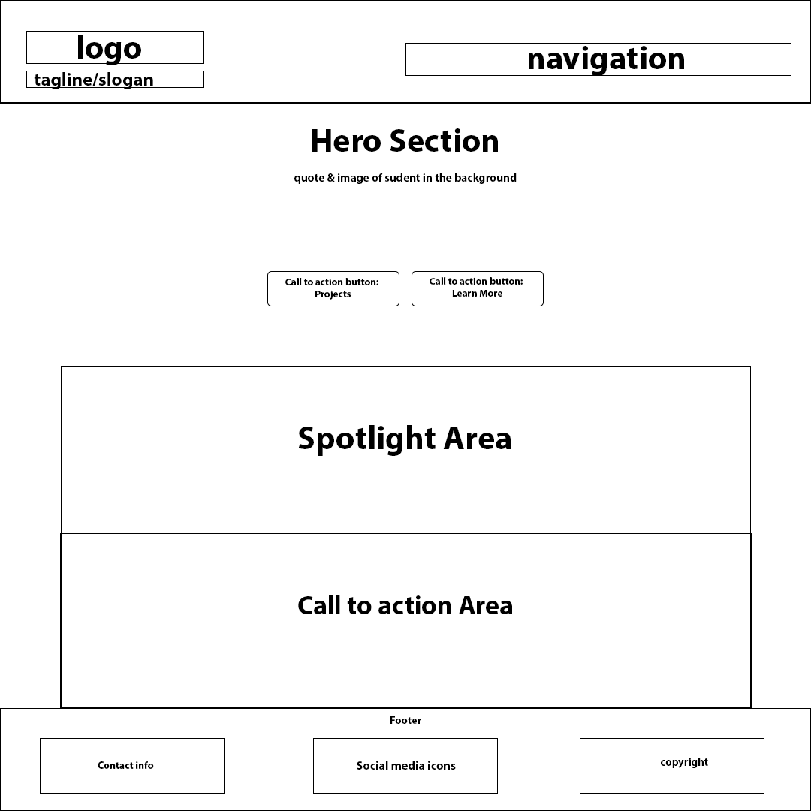
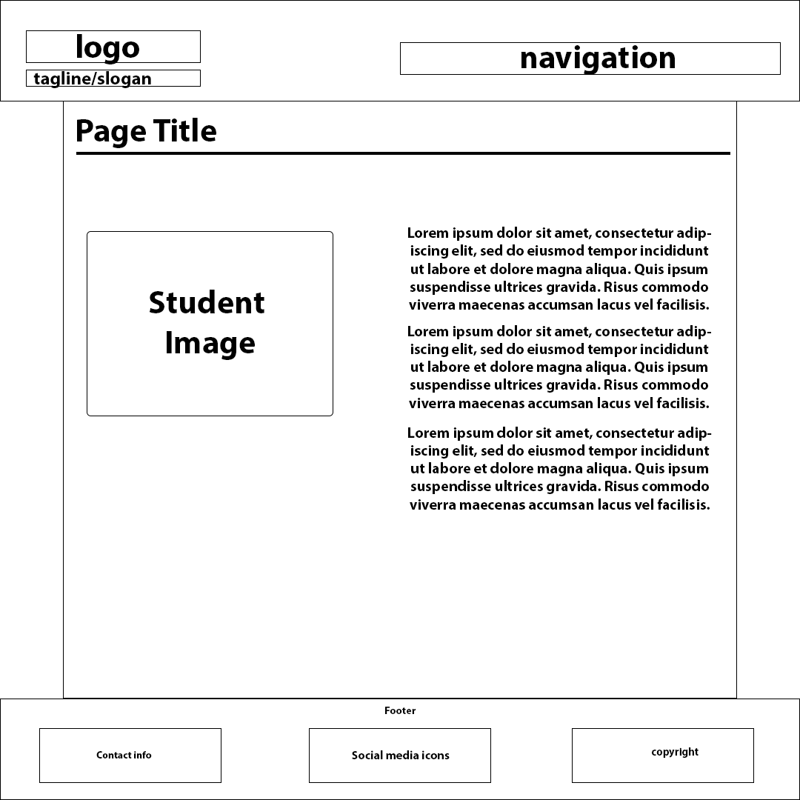
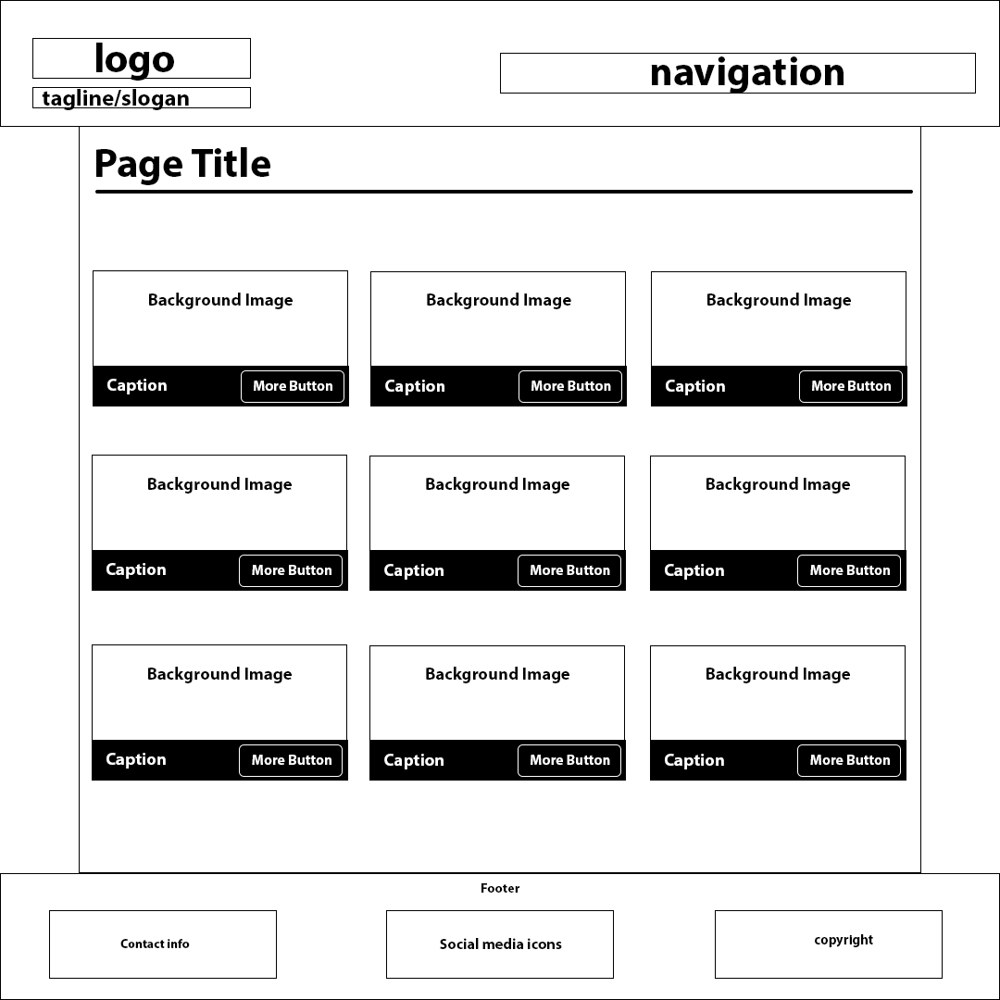
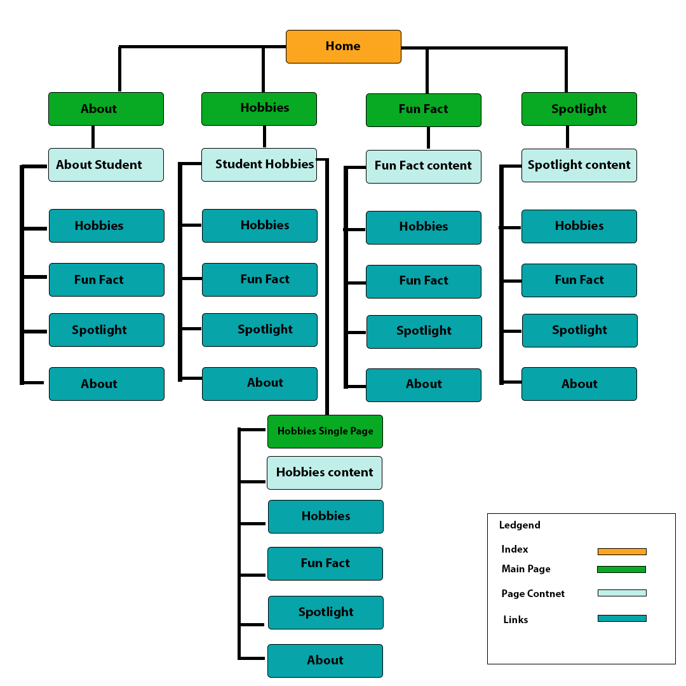

# Welcome to Exenreco's BioSite Dev...

<ul>
    <li><b>Student: </b>Exenreco Bell</li>
    <li><b>Project: </b>BioSite</li>
    <li><b>Class: </b>Web 200</li>
</ul>

  

<figure>
    
    <figcaption>Screenshot of BioSite</figcaption>
</figure>

  

# BioSite Website Plan

<h3>Ideas for your website</h3>

    Determine how you will use the BioSite website to showcase your subjects’ interests and hobbies.

<ul>
    <li>
        <b>Idea 1:</b> Interests & Hobbies - Create a dedicated section on each student's bio page that highlights their interests and hobbies. This could include a brief description, a photo, or even a short video clip. For example, if a student loves playing the guitar, you could add a picture of them holding their instrument along with a quote about why they love music.
    </li>
    <li>
        <b>Idea 2:</b>  Fun Facts - Add a "Fun Facts" section to each bio page that shares interesting and unique facts about each student. This could include things like their favorite sports team, what they like to do in their free time, or even a weird talent they have. For example, if a student loves playing soccer, you could add a fun fact like "When I'm not studying, I love playing pickup games with friends."
    </li>
    <li>
        <b>Idea 3:</b> Project Page - A dedicated page on the BioSite website that showcases student-led projects and hobbies. This could be a blog post, a video series, or even a podcast. For example, if a student loves writing poetry, you could feature their poems on the website with a brief bio about them.
    </li>
    <li>
        <b>Idea 4:</b> Spotlight - a regular feature on the BioSite website called "Spotlight" that highlights a different project each month (or quarter). This could include an interview-style post where the site owner talks about their interests and hobbies, or even just a simple showcase of their work. For example, if the site owner loves photography, you could feature some of their best shots along with a quote about what inspires them.
    </li>
    <li>
        <b>Idea 5:</b> Interactive Quizzes and Surveys - Create interactive quizzes and surveys that allow readers to share their interests and hobbies in a fun way. For example, you could create a quiz called "Which Hogwarts House Are You?" or a survey called "What's Your Favorite Hobbies?" that asks readers about their favorite activities outside of school. This can help generate engagement and encourage readers to share more about themselves.
    </li>
</ul>

# Website Plan
<table>
    <tr>
        <th><b>Topic</b></th>
        <th><b>Questions</b></th>
        <th><b>Response</b></th>
    </tr>
    <tr>
        <td><b>Purpose of Website</b></td>
        <td>
            
What is the purpose and goal of the website?

        </td>
        <td>
            
To create a unique and engaging way to showcase a student’s biographies and interests.

        </td>
    </tr>
    <tr>
        <td><b>Target Audience</b></td>
        <td>
            
Describe the target audience (age, gender, demographics)

        </td>
        <td>
            

                The website is designed to be inclusive of both me, women, boys and girls of any age and or any racial background, so there is no specific targeted gender or age as the targeted audience. The demography for this type of website includes but is not limited to students, employers, reviewers, and or random web viewers.
            

        </td>
    </tr>
    <tr>
        <td><b>Graphics</b></td>
        <td>
            
What graphics will you use on the website?

        </td>
        <td>
            
Graphics for this site may include but not limited to:

            <ol>
                <li>Photos and Videos of Student showcasing activities, interests and hobbies</li>
                <li>Open source Icons and illustrations to visual depict and emphases student related topics</li>
                <li>Open source fonts and typography to reflect the student’s tone and a unique visual experience.</li>
                <li>Images and videos showcasing student’s artwork, writing, projects demonstrating students’ skill.</li>
                <li>Additional Open source graphics, any other graphics that can be used to visually enhance the bioSite.</li>
            </ol>
        </td>
    </tr>
    <tr>
        <td><b>Color</b></td>
        <td>
            
What colors will you use within the site to enhance the purpose and brand?

        </td>
        <td>
            

                To enhance the purpose and brand of BioSite, I have chosen to work with a color palette of three different colors:
            

            <ol>
                <li>primary color:  #007bff</li>
                <li>secondary color: #ff9900, #34c759</li>
                <li>Accent color: #ff69b4, #333333</li>
            </ol>
            

                The primary color will be used for header and footer and other prominent elements, secondary color will be used as accent, highlights or to create visual interest and the Accent colors will be used to create contrast and support visual interest.
            

        </td>
    </tr>
    <tr>
        <td><b>Accessibility</b></td>
        <td>
            
How will the website accommodate people with disabilities?

        </td>
        <td>
            

                To ensure that the BioSite website is accessible and inclusive for people with disabilities the site will make uses of semantic html, aria attributes, high contrast mode and font size adjustments. Overtime, if the time frame allows it, it would also be useful to implement a screen reader, color contrast, keyboard navigation and regular accessibility testing.
            

        </td>
    </tr>
    <tr>
        <td><b>Project Timeline</b></td>
        <td>
            
Identify the project timeline

        </td>
        <td>
            

                To ensure a successful project execution, we are looking at a timeline of 5 – 6 weeks, this prediction considers:
            

            <ol>
                <li>Week 1 - 2 – Planning - project scope goals and objectives</li>
                <li>Week 3 - 4 – Content Creation – gathering graphics, student work and other materials</li>
                <li>Week 5 – 6 – Website development</li>
                <li>Week 6 – Testing and quality Assurance</li>
            </ol>
        </td>
    </tr>
</table>

# Wire-frames

<figure>
    
    <figcaption>Sketch of the home-page wire-frame.</figcaption>
</figure>

  

<figure>
    
    <figcaption>Sketch of the about-page wire-frame.</figcaption>
</figure>

  

<figure>
    
    <figcaption>Sketch of the hobby-page wire-frame.</figcaption>
</figure>

  

# Site Map

<figure>
    
    <figcaption>Bio Site Map</figcaption>
</figure>